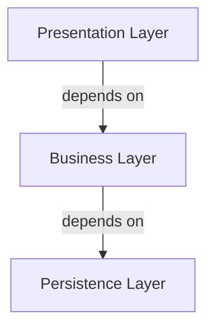
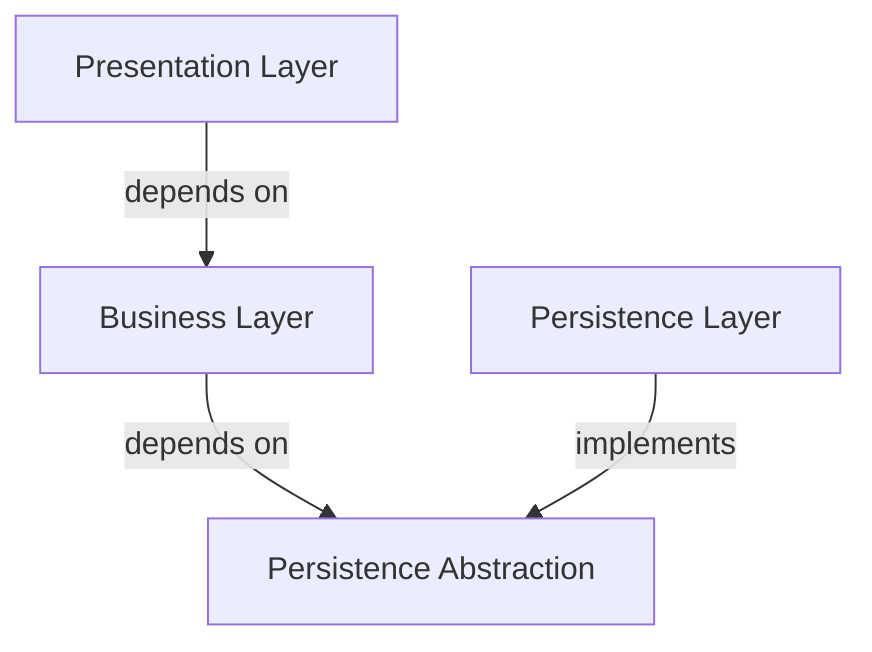

# Software Architecture Best Practices

This guide provides clear and actionable instructions for developing robust, scalable, and maintainable applications. 

Follows the glossary of terms and concepts from [AIDDbot Glossary](./aidd_glossary.instructions.md)

These are the foundational principles that govern our architectural decisions.

## 1. Separation of Concerns (SoC)

-  Each `module` of the `system` should have a distinct functional and technical responsibility. 
-  This is achieved by organizing code into `features` and `layers`.


| Layer↓ \ Feature→   | Users                   | Orders           | Logs                 |
| -------------------:| ----------------------- | ---------------- | -------------------- |
| Presentation        | UserForm, UserDTO       | OrdersList       |                      |
| BusinessLogic       | UserService, UserEntity | OrdersService    | LogUtil, LogEntryDTO |
| DataAccess          | UsersRepository         | OrdersRepository | LogFile              |

## 2. Screaming Architecture

- The folder structure should immediately reveal its purpose and business domain. 
- We achieve this by grouping by `features`, not by `layers`.

> Example for a TypeScript project

```txt
src/
├── users/
│   ├── user.form.ts
│   ├── user.dto.ts
│   ├── user.service.ts
│   ├── user.entity.ts
│   └── user.repository.ts
├── orders/
│   ├── orders.list.ts
│   ├── orders.service.ts
│   └── orders.repository.ts
└── logs/
    ├── log.util.ts
    ├── log-entry.dto.ts
    └── log.file.ts
```

### _✨ Optional: Grouping features for big projects_

When the number of features grows, organize them into three levels: `core`, `domain`, and `shared`.

- **Core**: Contains the essential components, usually required at startup or called from frameworks.
- **Domain**: Contains the application-specific logic, such as use cases, API endpoints, and UI components.
- **Shared**: Contains reusable components called by core or feature modules.

```txt
src/
├── core/             # Setup and framework features
│   ├── feature1/
│   └── feature2/
├── domain/           # Business or user features
│   ├── feature3/
│   └── feature4/
└── shared/           # Reusable cross-cutting features
    ├── feature5/
    └── feature6/
```

> "Scope Rules Structure": Code used by 2+ features goes to `shared`. Code used by 1 feature stays in `domain` or `core`.

## 3. Unidirectional Dependency Flow

- Dependencies must flow in a single direction between layers, typically from higher-level layers (e.g., presentation) to lower-level layers (e.g., data access).
- Given layers are not forced to be in folders, this rule is achieved with _discipline_ and/or enforced by tools.



### _✨ Optional: Dependency Inversion Principle (DIP) for clean Architectures_

- High-level (business) modules should not depend on low-level (presentation and persistence) modules. 

- All modules should depend on abstractions (interfaces or abstract classes).



- Frameworks should provide the necessary infrastructure to support this principle.

- If not, follow these steps:

1. Business layer defines interfaces for what it needs. 
2. Persistence layer implements those interfaces.
3. Presentation layer builds concrete classes that use these interfaces.

## 4. Repository Strategy

Choose your repository strategy based on team size, coupling requirements, and tooling needs:

### Single Repository per Application (Default)
- **When to use**: Independent applications with different release cycles
- **Structure**: Each application has its own repository with links to shared documentation

### Monorepo (When Appropriate)
- **When to use**: Highly coupled applications, shared libraries, consistent tech stack
- **Structure**: All applications and libraries are stored in a single repository.

## 5. Error Handling and Resilience Patterns

- Systems must be designed to handle failures gracefully and recover automatically when possible.
- Error handling should be consistent across layers and features.
- Implement defensive programming practices to prevent cascading failures.

