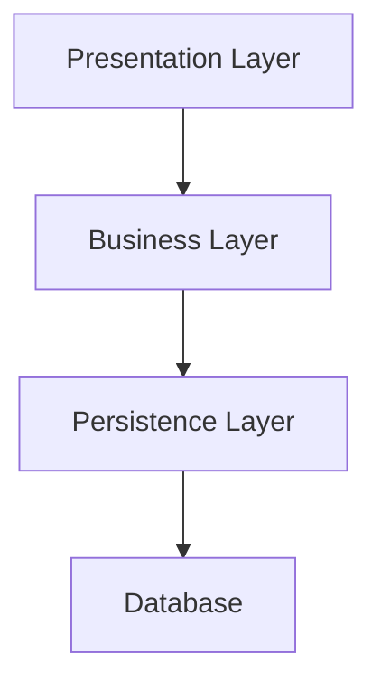

# Software Architecture Guide

## Concepts

* **Context (C1)**: The highest-level view in the C4 model. It represents the system as a whole, showing how it interacts with external actors such as users and other systems.
* **Container (C2)**: A container is an application or data store that can be independently deployed or executed. Examples include a web front-end, a back-end service, a database, or a message broker. Containers usually run within a tier and contain components organized in layers.Ex: Front-end app, API backend, DB, message broker.
* **Component (C3)**: Inside a container, a component represents a functional block of software, grouping classes, modules, or libraries that work together. Each component exposes an API and may depend on other components. Ex: Service, repository, controller, middleware.
* **Code (C4)**: The lowest-level view in the C4 model. Represents the implementation of a component in terms of classes, functions, and source code files.
* **Tier**: A physical separation of software systems, involving different servers, applications, or processes. Each tier can contain one or more containers. Typical tiers include Presentation, Application, and Data.
* **Layer**: A logical separation of concerns within a container or component. Layers group responsibilities (e.g., presentation, business, persistence) and interact through APIs. Unlike tiers, layers are logical and not physical.
* **Dependency**: A relationship where one element (component, layer, or container) requires another to function properly. Dependencies should be explicit and directional.
* **Dependency flow**: In layered designs, dependencies must follow a single direction, from higher to lower layers (e.g., Presentation → Business → Persistence). Cyclic dependencies are to be avoided.
* **Layered architecture**: A software design pattern that organizes code into distinct layers, each with specific responsibilities, and enforces controlled dependency flow between them.



Keep dependencies to a minimum and ensure a single direction of dependencies.

Use the DI of your framework to manage dependencies or pass dependencies explicitly to functions and classes.

## Structure

### Containers

Containers are physical separations of software systems. Create them in separate directories or repositories. Inside a container, define your components.
Can be developed in the same or in different repositories.

> Example for a monorepo:

```txt
my-monorepo-project/
├── docs/
├── container1/
│   ├── src/
│   └── README.md
├── container2/
│   ├── src/
│   └── README.md
└── README.md
```

> Example for multi-repo:

```txt
# Repo 1
container1/
  ├── src/
  └── README.md
# Repo 2
container2/
  ├── src/
  └── README.md
```

### Layers

Layers are abstract concepts:

* Do not create folders for each layer explicitly.
* Follow screaming architecture: **GROUP BY FEATURE** not by type.
* Organize when growing into three levels: `core`, `routes | commands`, and `shared`.

> Example inside one system:

```txt
# Simple Structure
src/
├── feature1/
├── feature2/
└── feature3/

# Complex Structure
src/
├── core/             # Setup and general features
│   ├── feature1/
│   └── feature2/
├── routes/           # Routed, usually business logic feature
│   ├── feature3/
│   └── feature4/
└── shared/           # Common features used by core and routes
    ├── feature5/
    └── feature6/
```

## Concrete examples

Inside each feature folder there are one or more components that belong to a specific layer. These can be represented at the C4 Component level.

Here you can find examples of features grouped in levels for different types of applications and their specific layers with their responsibilities.

### API server:

```txt
src/
├── core/                # Core application logic
│   ├── middlewares/     # Middleware functions
│   └── config/          # Configuration files
├── routes/              # API Route handlers
│   ├── users/           # User-related routes
│   └── products/        # Product-related routes
└── shared/              # Shared utilities and components
    ├── utils/           # Utility functions
    └── logger/          # Logging system
```

#### Presentation Layer

* **Responsibilities**:

  * Handles HTTP requests and responses.
  * Contains route handlers and controllers.
  * Define DTOs (Data Transfer Objects) for request and response data.
  * Perform input validation, authentication, and authorization.
  * Handle error responses and logging.
  * Return structured JSON responses and status codes.

* **Components**:

  * Route handlers
  * Controllers
  * Middleware
  * DTOs

#### Business Layer

* **Responsibilities**:

  * Contains the core business logic and application rules.
  * Use entities, services, and use cases to encapsulate business operations.
  * Orchestrate operations between repositories.
  * Return structured data objects.

* **Components**:

  * Entities
  * Services
  * Use Cases

#### Persistence Layer

* **Responsibilities**:

  * Responsible for data storage and retrieval, typically interacting with a database.
  * Use repositories and DTOs to abstract database operations.
  * Handle data access and external integrations.
  * Return primitive data or simple objects.
  * Is the only layer that knows about data sources.
  * Handle data transformation if needed.

* **Components**:

  * Repositories
  * Data Transfer Objects (DTOs)

### Web SPA:

```txt
src/
├── core/                # Core application logic
│   ├── interceptors/    # Api call interceptors
│   └── layout/          # Main layout components
├── routes/              # Page Route handlers
│   ├── users/           # User-related routes
│   └── products/        # Product-related routes
└── shared/              # Shared utilities and components
    ├── ui/              # UI components
    └── logger/          # Logging utilities
```

#### Presentation Layer

* **Responsibilities**:

  * Handles user interactions and displays data.
  * Contains components, templates, and styles specific to the UI.
  * Manages routing and navigation within the application.

* **Components**:

  * Containers (UI composition)
  * Presenters
  * UI Components
  * Templates

* **Best Practices**:

  * Use the Container/Presenter pattern to separate UI logic from business logic.
  * All components should be standalone by default.
  * Use reactive primitives (e.g., Signals) to communicate between components and templates.
  * Define and use shared components, directives, and pipes.

#### Business Layer

* **Responsibilities**:

  * Contains state management and application logic.
  * Orchestrates operations between repositories.
  * Returns reactive data structures.

* **Components**:

  * Services

* **Best Practices**:

  * Use services to encapsulate business logic and state management.
  * Use reactive primitives for state propagation.

#### Persistence Layer

* **Responsibilities**:

  * Responsible for data storage and retrieval, typically interacting with a remote API.
  * Define repositories and DTOs to abstract API operations.
  * Return primitive data or simple objects.
  * Is the only layer that knows about async operations.
  * Handle data transformation if needed.

* **Components**:

  * Repositories
  * Data Transfer Objects (DTOs)

### CLI application:

```txt
src/
├── core/                # Core application logic
│   └── config/          # Configuration files
├── commands/            # Command handlers
│   ├── users/           # User-related commands
│   └── products/        # Product-related commands
└── shared/              # Shared utilities and components
    ├── utils/           # Utility functions
    └── logger/          # Logging utilities
```

> End of Software Architecture best practices
