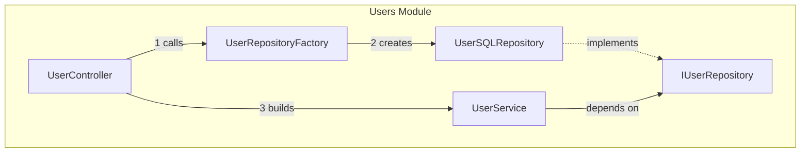

- If not, presentation-layer components should use factories to create instances of persistence-layer components and pass them to build business-layer components.

```mermaid
flowchart TD
  
  subgraph "Users Module"
    UC[UserController]
    UF[UserRepositoryFactory]
    US[UserService]
    UR[UserSQLRepository]
    IUR[IUserRepository]
  end

  UC -->|1 calls| UF
  UF -->|2 creates| UR
  UC -->|3 builds| US

  UR -.->|implements| IUR
  US -->|depends on| IUR
  
```