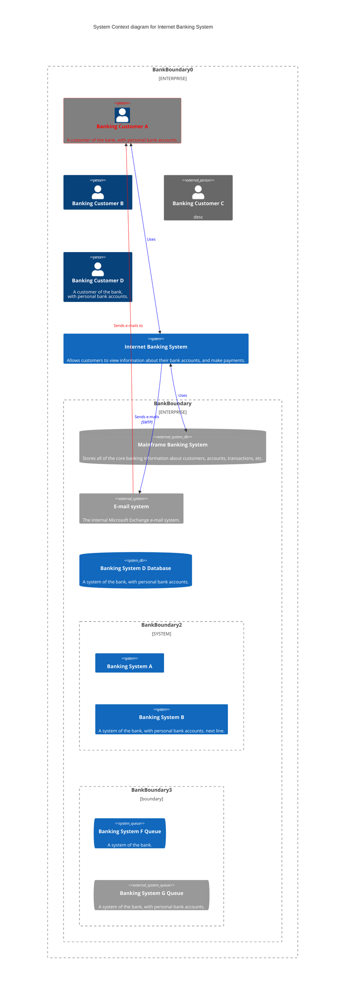
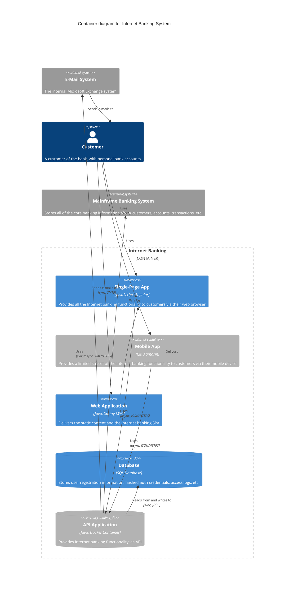
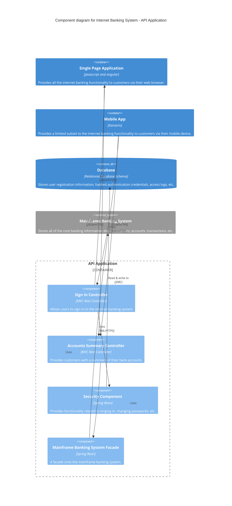

# Diagrams with C4 Model

Draw the C4 model diagrams in mermaid syntax.

The following sections has examples for the different levels of the C4 model:

## Level 1: Context Diagram

## Level 2: Container Diagram

## Level 3: Component Diagram

## Level 4: Code Diagram

-Not needed
